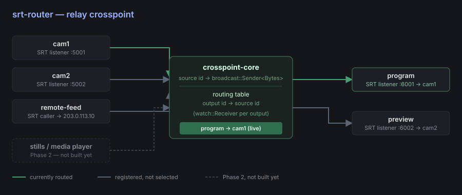
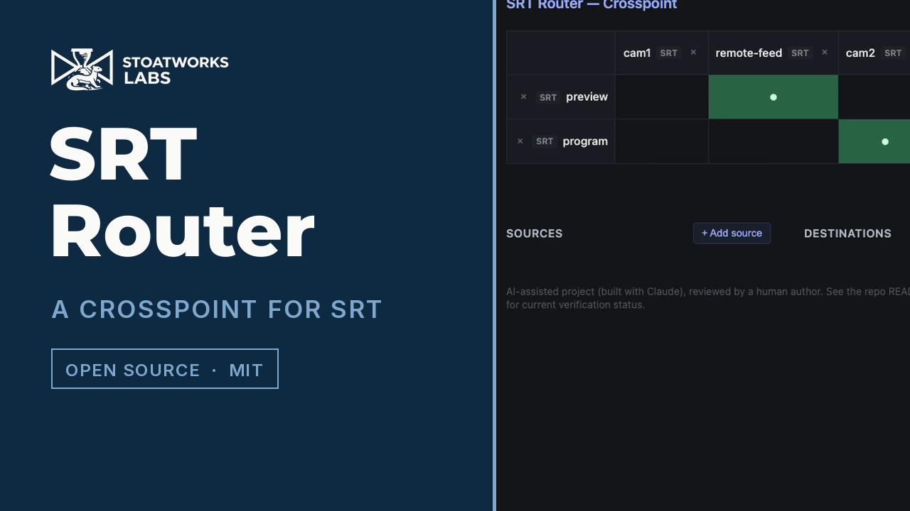
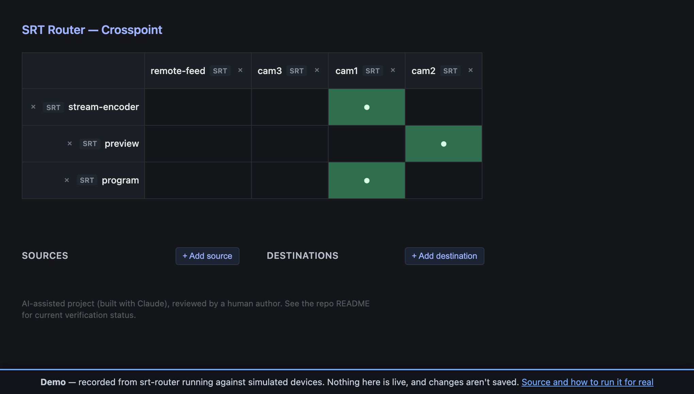
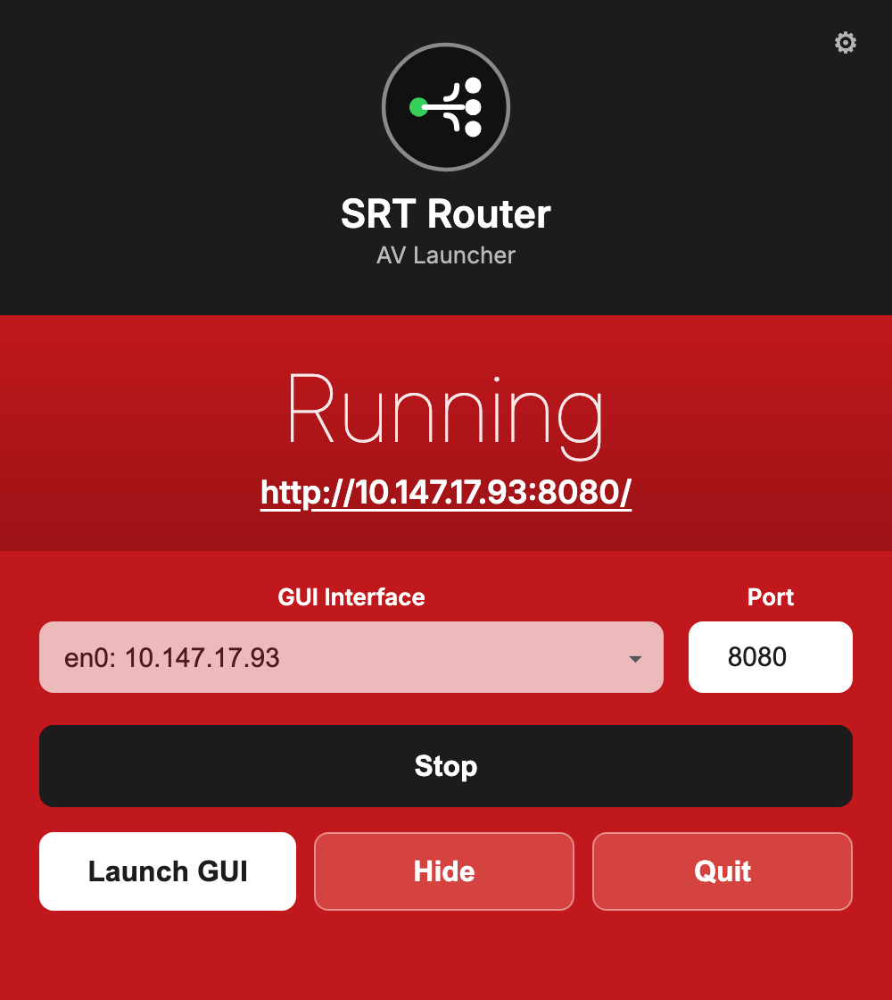

# srt-router

> **AI-assisted project.** This codebase was created with [Claude](https://claude.com/claude-code)
> (Anthropic), directed and reviewed by a human author. The relay/crosspoint
> engine and web UI have been exercised locally — including integration
> tests that relay real SRT and NDI protocol traffic end-to-end and a live
> crosspoint switch via the web UI, see [Status](#status) — but **not yet
> run against real-world third-party SRT/NDI encoders/decoders or over an
> actual (non-loopback) network path**. Review before relying on it for
> anything live.

A crosspoint-based [SRT](https://www.srtalliance.org/) router: any number of
SRT inputs, any number of SRT outputs, and a router-style crosspoint (each
output picks exactly one source, switchable live) connecting them — the same
mental model as a broadcast video router, applied to SRT streams instead of
SDI/HDMI.



[](https://www.youtube.com/watch?v=Jp6JLf51UgY)

*A 45-second tour, driven over the router's own REST API against
[config/example.toml](config/example.toml) — the same config as the screenshot below.*



*The web UI above is a real screenshot of the router running locally against
[config/example.toml](config/example.toml), not a mockup — captured while
verifying the routing/persistence/websocket/add-remove behavior described in
[Status](#status) below.*

**Try the crosspoint: <https://srt-router-demo.stoatworks-labs.com>** — the real UI,
in your browser, and the grid genuinely switches. Every switch replays the
router's own recorded response to that exact crosspoint change. Nothing there is
relaying a stream and nothing is saved; the router has to be on the network with
your SRT endpoints to do anything real. See [demo/README.md](demo/README.md) for
how it's built.

<!-- downloads:start -->

## Download

**[v0.2.2](https://github.com/stoatworks-labs/srt-router/releases/tag/v0.2.2)** — prebuilt for macOS, Windows and Linux. Pick your platform:

<details>
<summary><b>macOS</b> — Apple Silicon, Intel</summary>

| Build | Download | Size |
| --- | --- | --- |
| Apple Silicon · .tar.gz archive | [`srt-router-macos-aarch64.tar.gz`](https://github.com/stoatworks-labs/srt-router/releases/latest/download/srt-router-macos-aarch64.tar.gz) | 2.5 MB |
| Intel · .tar.gz archive | [`srt-router-macos-x86_64.tar.gz`](https://github.com/stoatworks-labs/srt-router/releases/latest/download/srt-router-macos-x86_64.tar.gz) | 2.6 MB |

</details>

<details>
<summary><b>Windows</b> — x64, ARM64</summary>

| Build | Download | Size |
| --- | --- | --- |
| x64 · .zip archive | [`srt-router-windows-x86_64.zip`](https://github.com/stoatworks-labs/srt-router/releases/latest/download/srt-router-windows-x86_64.zip) | 2.2 MB |
| ARM64 · .zip archive | [`srt-router-windows-aarch64.zip`](https://github.com/stoatworks-labs/srt-router/releases/latest/download/srt-router-windows-aarch64.zip) | 2.1 MB |

</details>

<details>
<summary><b>Linux</b> — x64, ARM64</summary>

| Build | Download | Size |
| --- | --- | --- |
| x64 · .deb package (Debian/Ubuntu) | [`srt-router_0.2.2_amd64.deb`](https://github.com/stoatworks-labs/srt-router/releases/download/v0.2.2/srt-router_0.2.2_amd64.deb) | 2.8 MB |
| ARM64 · .deb package (Debian/Ubuntu) | [`srt-router_0.2.2_arm64.deb`](https://github.com/stoatworks-labs/srt-router/releases/download/v0.2.2/srt-router_0.2.2_arm64.deb) | 2.9 MB |
| x64 · .rpm package (Fedora/RHEL) | [`srt-router-0.2.2-1.x86_64.rpm`](https://github.com/stoatworks-labs/srt-router/releases/download/v0.2.2/srt-router-0.2.2-1.x86_64.rpm) | 2.9 MB |
| ARM64 · .rpm package (Fedora/RHEL) | [`srt-router-0.2.2-1.aarch64.rpm`](https://github.com/stoatworks-labs/srt-router/releases/download/v0.2.2/srt-router-0.2.2-1.aarch64.rpm) | 3.0 MB |
| x64 · .tar.gz archive | [`srt-router-linux-x86_64.tar.gz`](https://github.com/stoatworks-labs/srt-router/releases/latest/download/srt-router-linux-x86_64.tar.gz) | 2.8 MB |
| ARM64 · .tar.gz archive | [`srt-router-linux-aarch64.tar.gz`](https://github.com/stoatworks-labs/srt-router/releases/latest/download/srt-router-linux-aarch64.tar.gz) | 2.8 MB |

</details>

All builds, checksums and release notes: [github.com/stoatworks-labs/srt-router/releases](https://github.com/stoatworks-labs/srt-router/releases).

macOS builds are signed and notarised and open normally. The Windows builds are unsigned, so SmartScreen warns once — see [Windows SmartScreen & Defender Firewall](#windows-smartscreen--defender-firewall) for the one-time click-through.

<!-- downloads:end -->

## What it does

By default, routing is a **pure relay**: the crosspoint moves opaque payload
chunks from an input SRT connection to an output SRT connection with no
decode/re-encode, so switching is effectively free (no transcode cost, no
added latency beyond SRT's own buffering). That's the right behavior for the
common case — plain stream switching — but it's not the *only* thing a
source can be. The engine's source abstraction is intentionally payload-only
(see [docs/architecture.md](docs/architecture.md)), so special-purpose
sources that actually generate a stream — a still image, a local media
player, a scaler tap on another source — register into the same crosspoint
as a "source" without the engine caring that they're not relayed SRT.
**Built**: `crates/media-io` runs `ffmpeg` as a child process for all
three (stills/media-player/scaler), publishing plain MPEG-TS `Bytes` — the
same wire format an SRT relay carries — so a stills slate can feed a live
SRT output directly, no transcoding step required. No SDK, no Cargo
feature: just `ffmpeg` on `PATH` at runtime. See [Status](#status).

Control is a local web UI backed by a small REST API: a crosspoint grid
(click a cell to route that output from that source), plus **Add
source**/**Add destination** menus and a remove control on every row/column
for adding or tearing down SRT inputs/outputs at runtime — not just what was
in the TOML config at startup. No auth/TLS — this is meant to run on a
trusted operations network, the same trust model as a hardware router's
control port.

**Transports beyond SRT:** `crates/ndi-io` is a real, tested NDI transport
and `crates/omt-io` is the same idea for
[OMT](https://openmediatransport.org/) — a genuinely open, MIT-licensed
alternative to NDI — implemented via hand-written FFI against the real SDK
(requires `OMT_LIB_DIR`, no bindgen). Both are fully wired into the router:
usable from the TOML config **and** the runtime add-source/add-destination
REST API **and** the web UI's Add source/Add destination menus. **NDI is on by
default** — it loads its runtime at run time and needs no SDK to build; OMT
stays behind an opt-in `omt` Cargo feature because it still links at build
time (`cargo run --features omt`). `crates/media-io` (stills/media-player/scaler, see
[What it does](#what-it-does)) needs no feature — just `ffmpeg` on `PATH`.
Every input/output entry — TOML or REST — now needs an explicit
`transport = "srt" | "ndi" | "omt" | "media"` tag; see
[config/example.toml](config/example.toml).

## Status

**Phase 1: relay-only crosspoint + web UI, dynamic add/remove — done.**
**Phase 2 (current): special-purpose (non-relay) sources — done.**
Working:

- SRT input/output as either `listener` (this router waits for a
  connection) or `caller` (this router dials out), each reconnecting on its
  own if the connection drops.
- The crosspoint engine (`crates/core`) — output-follows-route-change
  behavior is unit tested.
- A local web UI (`crates/web`) — grid of outputs x sources, click to route,
  updated live over a websocket (`GET /ws`) with a REST poll (`GET
  /api/state`) as first paint / fallback.
- **Runtime add/remove**: `POST`/`DELETE /api/manage/sources` and
  `/api/manage/outputs` (`crates/router/src/management.rs`) spawn or tear
  down an SRT input/output on the fly — the same code path the static TOML
  config uses at startup, so a config-declared source is exactly as
  removable as one added later. Backed by
  [`tokio_util::sync::CancellationToken`](https://docs.rs/tokio-util) per
  task (added to `srt-io`) so removal actually stops the task and frees the
  socket, not just forgets about it. The web UI exposes this as **Add
  source**/**Add destination** forms plus a remove control per row/column.
- Routing changes optionally persist to disk (`[state]` in the config) and
  reload on restart, overriding each output's `default_source`.
- `crates/ndi-io`: a real NDI transport, with its own integration test driving
  a real NDI sender and receiver against it, consistently passing. Fully wired
  into `srtrouter`'s TOML config, the runtime add/remove REST API, **and** the
  web UI's Add source/Add destination menus. **Built by default**: its `sys`
  module loads the NDI runtime with `dlopen`, so nothing needs the proprietary
  SDK at build time and NDI is present in every cross-compiled release. (It
  previously used `grafton-ndi`, which linked the SDK at build time — that kept
  the feature off for every release target, so released binaries had no NDI at
  all.) A machine with no NDI runtime still builds and runs the router; only an
  NDI endpoint fails, and the message names the download.
- `crates/omt-io`: a real, tested [OMT](https://openmediatransport.org/)
  transport via hand-written FFI against the OMT SDK (`OMT_LIB_DIR`, no
  bindgen), with its own relay integration test. Wired in exactly the same
  way as NDI — TOML config, REST API, web UI menus — behind an opt-in `omt`
  Cargo feature (`cargo run --features omt`). It composes with NDI, which is
  on by default; an explicit `transport` tag on every
  input/output disambiguates them even where their endpoint shapes are
  otherwise identical (NDI's and OMT's `Sender { name }`, in particular —
  see [docs/roadmap.md](docs/roadmap.md) for why that mattered).
- `crates/media-io`: stills, a local media player, and a decode/rescale/
  re-encode scaler tap, each running real `ffmpeg` as a child process and
  publishing plain MPEG-TS `Bytes` — no envelope, no proprietary SDK, no
  Cargo feature (just `ffmpeg` on `PATH`). Fully wired into the TOML
  config, the REST API, and the web UI's Add source menu (source-only —
  none of these make sense as an output). A `media` source routes straight
  into an SRT output with no transcoding step, since they share the same
  raw-MPEG-TS payload class; the web crate's cross-kind route check
  encodes that explicitly rather than requiring exact kind-string equality.
  Scaler additionally consumes another registered source's own `Bytes`
  (subscribe, pipe into ffmpeg's stdin) — the one non-relay path here that
  really does transcode.
- CI (GitHub Actions) runs `fmt --check`, `clippy -D warnings`, and the full
  test suite on every push/PR — SRT (+media) only (`ndi-io`/`omt-io` need
  real SDKs CI can't install, so they're real workspace members but
  excluded from `default-members`; `media-io` needs only `ffmpeg`, which CI
  installs explicitly — see [docs/architecture.md](docs/architecture.md)).
- Verified locally, not just compiled: `cargo test` passes — the default build
  (SRT + media + NDI) and `--features omt` both build and pass clean —
  including integration tests
  (`crates/srt-io/tests/relay.rs`, `crates/ndi-io/tests/relay.rs`,
  `crates/omt-io/tests/relay.rs`, `crates/media-io/tests/relay.rs`) that
  relay real protocol traffic (or, for media-io, real ffmpeg-produced
  MPEG-TS, byte-checked for valid sync bytes) end-to-end through the
  crosspoint — one SRT test also exercises a **live re-route mid-stream
  over an already-established connection**, and one media-io test proves
  the scaler recovers once its upstream source appears late. Separately
  confirmed by hand: running the binary against `config/example.toml` binds
  real UDP/SRT listener sockets (via `lsof`), adding a source through the
  web UI binds a new one live and removing it frees the port (also via
  `lsof`), the REST API and a real browser click both drive live crosspoint
  changes, the websocket push updates the grid with no client-side polling,
  a persisted route survives a real process restart, adding an OMT
  source/destination through the running web UI produces the correct
  `omt`-badged rows on the grid, and adding real stills/media-player/scaler
  sources through the running web UI (backed by real generated test
  images/video) produces `media`-badged rows that route cleanly into a
  live SRT output.

**Not yet done:** no test against a real third-party SRT/NDI/OMT encoder or
decoder, or over a real (non-loopback) network path — only local testing so
far, still the main open gap. Also missing: auth on the web UI/API,
external control API/Companion integration. See
[docs/roadmap.md](docs/roadmap.md) for the full phased
plan.

## Quick start

```sh
cargo run --bin srtrouter -- --config config/example.toml
```

Then open `http://localhost:8080` for the crosspoint grid. Edit
[config/example.toml](config/example.toml) (or point `--config` at your own
file) to declare your actual inputs/outputs — see the comments in that file
for the config format.

## Desktop app

Prefer not to touch the terminal? A small menu-bar app lets you pick the network
interface + port, Start/Stop the server, and open the web UI. The `srtrouter`
server is bundled inside, so it's a single download — nothing to install or wire
up. Grab the `.dmg` from
[Releases](https://github.com/stoatworks-labs/srt-router/releases), or see
[launcher/](launcher/) to build it.

<p align="center"></p>

## Architecture

See [docs/architecture.md](docs/architecture.md) for the source/output/
crosspoint model and how the relay-vs-generated source distinction is meant
to extend later without changing the core engine.

## Windows SmartScreen & Defender Firewall

macOS builds are **Developer ID-signed and notarised by Apple** — they open
normally, with no Gatekeeper warning and no quarantine step. The Windows
binaries are **not** code-signed, so Windows still warns you the first time.

- **Windows** — SmartScreen shows *"Windows protected your PC"* →
  **More info** → **Run anyway**.
- **Windows Defender Firewall** — first launch pops *"Allow SRT Router to communicate on
  these networks"*. Tick **Private** (and **Domain** on a managed network) — SRT Router
  needs it to serve the web UI on the interface you pick and accept inbound SRT streams.
  Deny it and the UI won't load from another machine and inbound SRT callers will time
  out.
- **Linux** — no signing gate.

Per-artifact steps, self-signing, checksum verification and the Defender Firewall reset
procedure: **[docs/UNSIGNED.md](docs/UNSIGNED.md)**.

## Roadmap / TODO

Full phased plan in [docs/roadmap.md](docs/roadmap.md). Main open items:

- [ ] **Real-world testing** — against a third-party SRT/NDI/OMT encoder/decoder and over a real (non-loopback) network path; the main open gap.
- [x] **NDI and OMT live in the web UI, config, and REST API** — disambiguated by an explicit `transport` tag per input/output. NDI ships by default (runtime loaded with `dlopen`, no SDK needed to build); OMT stays behind an opt-in `omt` feature.
- [x] **Special-purpose sources** — stills, local media player, scaler tap, all built on real `ffmpeg` child processes and live in the web UI's Add source menu, config, and REST API.
- [ ] **Auth/TLS** on the web UI/API.
- [ ] **External control API / Bitfocus Companion** integration.

## Control it from Companion

[**companion-module-srt-router**](https://github.com/stoatworks-labs/companion-module-srt-router) is a [Bitfocus Companion](https://bitfocus.io/companion) connection module for this app.

Takes, cycles and salvos on the crosspoint, plus runtime add/remove — with
crosspoint tally and source-side tally.

Crosspoint presets are **generated from the router's own sources and outputs**
once the module connects, one section per output, so a row of buttons is one
section dragged onto a page.

It is not in the official Companion module store — install it via
**Settings → Developer modules path**.

## Trademarks and third-party licences

**NDI® is a registered trademark of Vizrt NDI AB.** See <https://ndi.video>.
This project is not affiliated with or endorsed by Vizrt.

The NDI runtime is obtained separately under Vizrt's own terms and is not
redistributed here. NDI Tools are not redistributed either — get them from
<https://ndi.video/tools>.

H.264, H.265 and AAC are separately licensable formats. The NDI SDK grant does
not cover them, and the obligation sits with whoever ships a product using them.

<!-- attributions:start -->
This project is built on other people's work — see [ATTRIBUTIONS.md](ATTRIBUTIONS.md).
<!-- attributions:end -->
